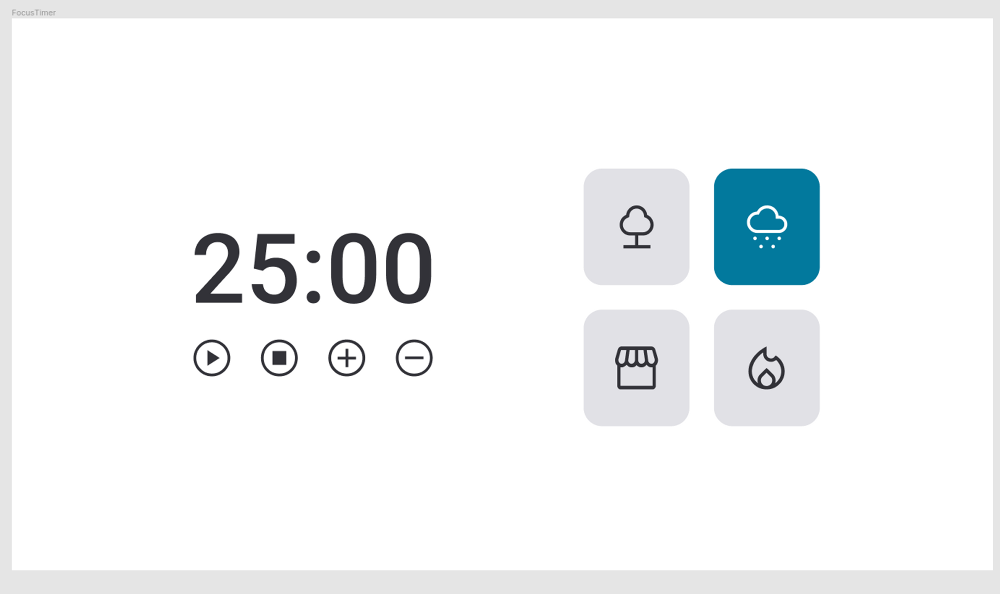

# Focus timer 2.0

# Preview

# Instruções:
Funcionalidades esperadas dos botões:

- Play   : aciona o timer;
- Stop   : para o timer;
- + : aumenta em mais 5 minutos o tempo do timer;
- - : diminui em 5 minutos o tempo do timer.

Cada card que se encontra do lado direito, quando selecionado, vai mudar de cor e emitir um som diferente

# Melhorias

Animações incluidas
 - Zoom
 - Shake

Icons from FontAwesome

# License

This project is licensed under the MIT License - see the LICENSE.md file for details